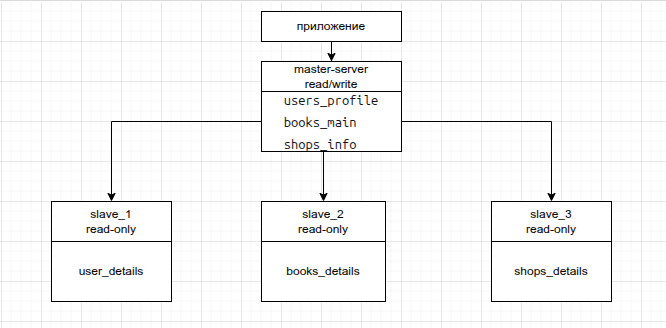
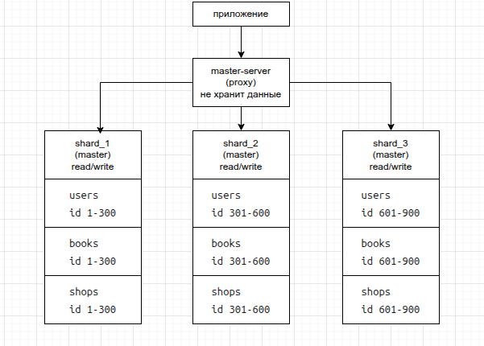

# Домашнее задание к занятию «Репликация и масштабирование. Часть 2»

### Задание 1
  Опишите основные преимущества использования масштабирования методами:

   - активный master-сервер и пассивный репликационный slave-сервер;
   - master-сервер и несколько slave-серверов;

*Дайте ответ в свободной форме.*

**Ответ 1**

  При использовании активного master-server и пассивного slave-server.

  Высокая отказоустойчивость, при падении master-server автоматически или в ручную происходит переключение на slave-server.

  Упрощённое управление. Конфигурация проще, чем с несколькими slave: меньше серверов для настройки.

  Уменьшение нагрузки на активный master, пассивный slave можно временно задействовать для создания бэкапов или выполнения аналитических запросов. Это не повлияет на производительность основного сервера.

  При использовании master-server и нескольких slave-server.

  Высокая отказоустойчивость.

  Общее увелечение производительности, за счет распределения операций чтения на slave-server. Возможность настроить шардинг (распределение данных по разным серверам)

  Возможность географического распределения, для уменьшения latency для пользователей.

При схеме master и один slave оснавная цель надёжность, при схеме с несколькими slave повышается производительность.

### Задание 2
  Разработайте план для выполнения горизонтального и вертикального шаринга базы данных. База данных состоит из трёх таблиц:
   - пользователи,
   - книги,
   - магазины (столбцы произвольно).
  Опишите принципы построения системы и их разграничение или разбивку между базами данных.
*Пришлите блоксхему, где и что будет располагаться. Опишите, в каких режимах будут работать сервера.*

**Ответ 2**

Вертикальный шардинг.
  Три исходные таблицы (users, books, shops) находятся на одном master-сервере.
  
  Каждая таблица делится по столбцам на две части:
   - Часто используемые столбцы — остаются на master.
   - Редко используемые или объёмные — переносятся на отдельные slave-серверы (по одному на таблицу).

  slave-сервера настраивуются в режиме read-only, все запросы идут на мастер.

Горизонтальный шардинг.

  Три исходные таблицы делятся по строкам.
   - На master сервере данные не хранятся, сервер маршрутизирует запросы к нужным шардам.
   - Три шарда — каждый хранит часть строк всех трёх таблиц (users, books, shops).
   - Ключ шардирования — id для каждой таблицы.
   - Приложение обращается к мастеру, а мастер перенаправляет запрос на нужный шард.

  master сервер настраивается в режиме Proxy (без данных). Шард сервера в режиме Read/Write

